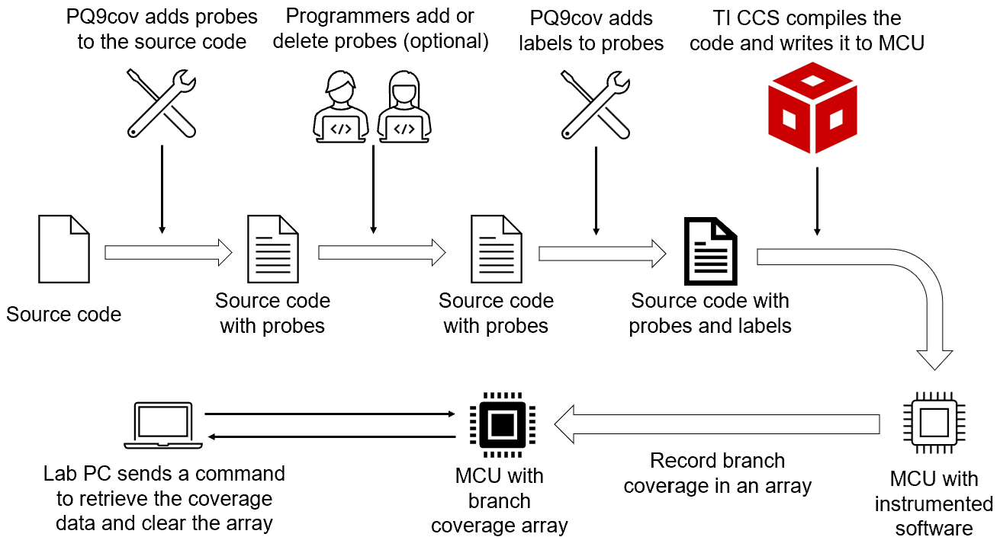
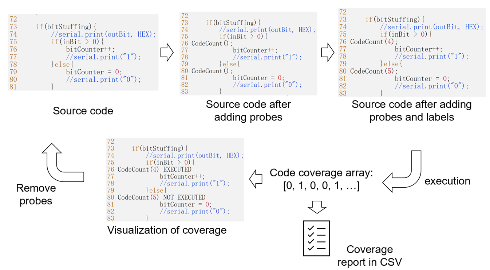
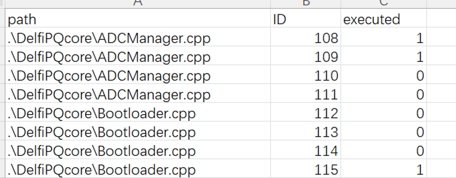

## Code Coverage Collection from Microcontrollers
It's a simple tool to measure branch coverage of C/C++ programs. 

 - The tool can run on any type of micro-controllers if you can load programs to them and communicate with them. 
 - It can generate coverage reports in CSV files or show the coverage result in your source code.
 - It will instrument your source code automatically. The instrumentation is not very accurate. However, you can modify the instrumentation result easily before running the instrumented program.
 - Since the tool is very simple (~150 lines of code), you can modify it easily.

### How to use it?

 1. Run `python3 pq9cov.py -i <path1> <path2> ...` to add probes automatically in your source code. \<path1\>,  \<path2\>, ... are the paths of source code files or folders. 
 2.  You can add or delete probes from the source code manually.
 3. Run `python3 pq9cov.py -l <path1> <path2> ...` to add labels to the probes.
 4. Compile your source code with CodeCoverageArray.h and CodeCoverageArray.cpp. 
 5. Load the program to the micro-controller and run it. Now, the program will trigger the function call CodeCount() at the beginning of every branch. CodeCount() will record the status of this branch with one bit in the `coverageArray`
 6. You need to implement your code to retrieve `coverageArray` to your PC.
 7. Assume `record.txt` is the coverage result. You can generate coverage report and visualize coverage result in source code via `python3 pq9cov.py -a <path of record.txt> ...`
 8. You can remove coverage result from the source code via `python3 pq9cov.py -c <path1> <path2> ...`
 9. You can remove all probes from the source code via `python3 pq9cov.py -d <path1> <path2> ...`

### What does the result look like? 

### Citation
Basic idea of this tool comes from GeCov ([EDI-Systems/G2T01_GeCov: Simple general-purpose embedded system code coverage test tool (github.com)](https://github.com/EDI-Systems/G2T01_GeCov))

If you use the tool, please cite the following work:

*Li, Z. (2022). Use Reinforcement Learning to Generate Testing Commands for Onboard Software of Small Satellites.*
